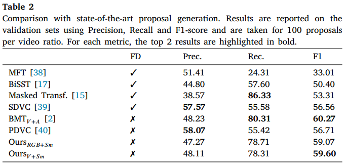
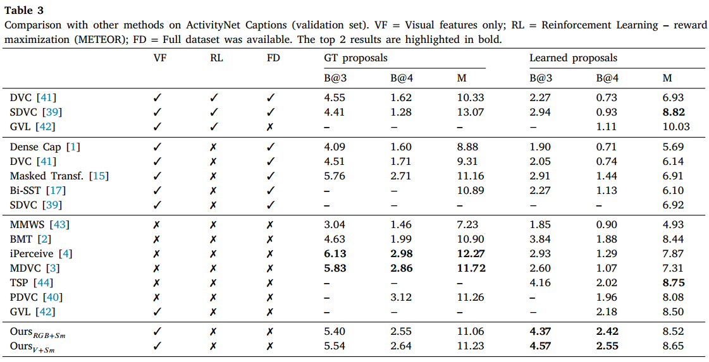

# **Dense Video Captioning Using Unsupervised Semantic Information**

## **Summary**

This repository contains an implementation of the GloVe NLP method adapted to visual features as described in the paper ''Dense Video Captioning Using Unsupervised Semantic Information'' [[ArXiv](https://arxiv.org/abs/2112.08455)] [[JVCI](https://www.sciencedirect.com/science/article/pii/S1047320324003419)].

Visual GloVe provides a dense representation encoding a co-occurrence similarity estimation with a semantic space in which short video clips with similar visual content are projected near to each other. The figure below illustrates this representation.


**Figure.** Examples of visual similarities. (a) Two video fragments with about 28 seconds from YouTube (vdBNZf90PLJ0 and vj3QSVhAhDc). They share some visual similar short clips. (b) A 2D t-sne representation for the whole visual vocabulary. Some shared fragments are highlighted in red.

We employ Visual GloVe to replace audio signal in the BMT model (see references) to learn an event proposal model for the Dense Video Captioning (DVC) task. Additionally, we concatenate Visual GloVe with i3D features and feed the MDVC model (see references) to generate captions for each learned proposals. Using this descriptor, we achieve state-of-the-art performance on DVC taking only visual features (i.e., using a single modality approach), as shown in the following tables.





The code was tested on Ubuntu 20.10 with NVIDIA GPU Titan Xp. Using another software/hardware might require adapting conda environment files.

## **Visual Glove Computation**

### Step 1: clone this repository

```bash
git clone --recursive git@github.com:valterlej/visualglove.git
```

### Step 2: create the conda environment

```bash
conda env create -f ./conda_env.yml
conda activate visualglove
```

### Step 3: get visual features 
a. download annotations and visual features from:

annotations (.json) https://cs.stanford.edu/people/ranjaykrishna/densevid/captions.zip

features (.npy) - https://1drv.ms/u/s!Atd3eVywQZMJgnFmEqYoFg3fq8w9?e=SUOrbE

b. compute your own visual features using the code from https://github.com/v-iashin/video_features . All instructions you need are presented in it.

All features and configuration files are saved in a shared dataset directory in our experiments. In our case, we create this directory in 'home' and refer to it using ~/dataset.

### Step 4: train the model with main.py script

```bash
python main.py --procedure training \
    --train_ids_file ~/dataset/train.json \
    --visual_features_dir ~/dataset/i3d_25fps_stack64step64_2stream_npy \
    --vocabulary_size 1500 \
    --vg_window_size 5 \
    --vg_emb_dim 128
```

With this command, we learn clustering and visual glove models.

You can extract the cluster predictions using the pre-trained cluster model for all video stacks from *visual_features_dir* with the command:

```bash
python main.py --procedure cluster_predictions \
    --output_cluster_predictions_dir <directory path>
```

Extract visual embeddings using the cluster and visual glove pre-trained models. The command is:

```bash
python main.py --procedure visual_glove_embeddings \
    --output_embedding_dir ~/datasets/visglove_acnet_w5_c1500 \
    --output_concatenated_stack_embedding ~/datasets/i3dvisglove_acnet_w5_c1500
```

## **Training the Proposal Module**

### Step 1: clone the repository

```git
git clone --recursive https://github.com/valterlej/CustomBMT.git
```

### Step 2: create and activate the conda environment

```bash
conda env create -f ./conda_env.yml
conda activate bmt
```

### Step 3: install the spacy module

```bash
python -m spacy download en
```

### Step 4: get or compute the features

You can download all necessary features using the links provided in the 'pre-computed features' section, or you can compute them following the instructions from 'Visual GloVe computation section.

### Step 5: train the captioning model using CustomBMT (bi-modal transformer)

Training
```bash
python main.py --device_ids 0 \
    --video_features_path ~/datasets/i3d_25fps_stack64step64_2stream_npy \
    --audio_features_path ./data/visglove_acnet_w5_c1500 \
    --procedure train_cap \
    --epoch_num 100 \
    --early_stop_after 25 \
    --dout_p 0.1 \
    --d_vid 1024 \
    --d_model 1024 \
    --d_aud 128
```

### Step 6: train the event proposal generation module using CustomBMT (bi-modal transformer)

Training
```bash
python main.py --device_ids 0 \
    --video_features_path ~/datasets/i3d_25fps_stack64step64_2stream_npy \
    --audio_features_path ~/datasets/visglove_acnet_w5_c1500 \
    --procedure train_prop \
    --epoch_num 80  \
    --early_stop_after 20 \
    --pretrained_cap_model_path ./log/train_cap/1203220645/best_cap_model.pt
```


Evaluating
```bash
python main.py --device_ids 0 \
    --video_features_path ~/datasets/i3d_25fps_stack64step64_2stream_npy \
    --audio_features_path ~/datasets/visglove_acnet_w5_c1500 \
    --procedure evaluate \
    --pretrained_cap_model_path ./log/train_cap/<dataset_log>/best_cap_model.pt \
    --prop_pred_path ./log/train_prop/<dataset_log>/submissions/<json_submission_file>
```


## **Training and Evaluating Captioning - CustomMDVC**


### Step 1: clone the repository

```git
git clone https://github.com/valterlej/CustomMDVC.git
```

### Step 2: create and activate the conda environment

```bash
conda env create -f ./conda_env.yml
conda activate mdvc
```

### Step 3: install the spacy module

```bash
python -m spacy download en
```

### Step 4: get or compute the features

Skip this step if you are retraining the proposal generation model. Otherwise, download visual glove features [here](https://1drv.ms/u/s!Atd3eVywQZMJgnIH156XyewdCEuu?e=Mos3hF).

### Step 5: train the captioning model with CustomMDVC (vanilla transformer)

Download de file containing our pre-trained [BMT proposals](https://1drv.ms/u/s!Atd3eVywQZMJgwJFZaaIagGKSHNz?e=HSeVPW) (.zip) in the same format adopted by MDVC. Then, run the following command:

```bash
python main.py --device_ids 0 \
    --d_vid 1152 \
    --epoch_num 80 \
    --early_stop_after 20 \
    --video_features_path ./datasets/i3dvisglove_acnet_w5_c1500 \
    --model_type visual
    --val_prop_meta_path ./datasets/bmt_prop_results_val_1_e26_maxprop100_mdvc.csv
```

## **Pre-computed features**

- [i3D features](https://1drv.ms/u/s!Atd3eVywQZMJgnFmEqYoFg3fq8w9?e=SUOrbE) (64 stack 64 step)
- [Visual Glove Features](https://1drv.ms/u/s!Atd3eVywQZMJgnIH156XyewdCEuu?e=Mos3hF) (i3d+Visglove and Visglove only)
- [VGGish features](https://1drv.ms/u/s!Atd3eVywQZMJgnCPED7TKSGH7hmP?e=lOb5aj) (only if you desire to reproduce the MDVC or BMT results)

## **Pre-trained models**

- [Cluster and Visual Glove models](https://1drv.ms/u/s!Atd3eVywQZMJgm82Zcj0exjJTTNH?e=oBMBr6) (trained considering window = 5 clips -- ~10s -- and vocabulary = 1500 clusters)
- [BMT captioning model](https://1drv.ms/u/s!Atd3eVywQZMJgnRmqWwxtzWM2gKV?e=mCAUb6) - used for training the proposal module
- [BMT proposal generation model](https://1drv.ms/u/s!Atd3eVywQZMJgnfJoX9YTJ1BMXpK?e=mGaxLT)
- [MDVC](https://1drv.ms/u/s!Atd3eVywQZMJgnvzADj4p0AVNbxL?e=KPbHFc) - mdvc model trained with the concatenation of i3d and visual glove features.

## **Main References**

Mini-batch k-means
- Sculley, D. **Web-Scale k-Means Clustering**. In International Conference on World Wide Web, 2010, pp. 1177-1178.

GloVE
- Pennington, J.; Socher, R.; Manning,  C. D. **GloVe: Global Vectors for Word Representation**. In. Conference on Empirical Methods in Natural Language Processing (EMNLP), 2014, pp. 1532-1543.

MDVC
- Iashin, V.; Rahtu, E. **Multi-Modal Dense Video Captioning**. In IEEE Conference on Computer Vision and Pattern Recognition (CVPR) Workshops, 2020, pp. 958-959.

BMT
- Iashin, V.; Rahtu, E. **A Better Use of Audio-Visual Cues: Dense Video Captioning with Bi-modal Transformer**. In. British Machine Vision Conference (BMVC), 2020.

For the complete list, see the paper.

## **Citation**

Our paper is available on JVCI. Please, use this BibTeX if you would like to cite our work.

```latex
@article{ESTEVAM2025,
author = {Valter Estevam and Rayson Laroca and Helio Pedrini and David Menotti},
title = {Dense video captioning using unsupervised semantic information},
journal = {Journal of Visual Communication and Image Representation},
volume = {107},
pages = {104385},
year = {2025},
issn = {1047-3203},
doi = {https://doi.org/10.1016/j.jvcir.2024.104385},
url = {https://www.sciencedirect.com/science/article/pii/S1047320324003419}
}
```
